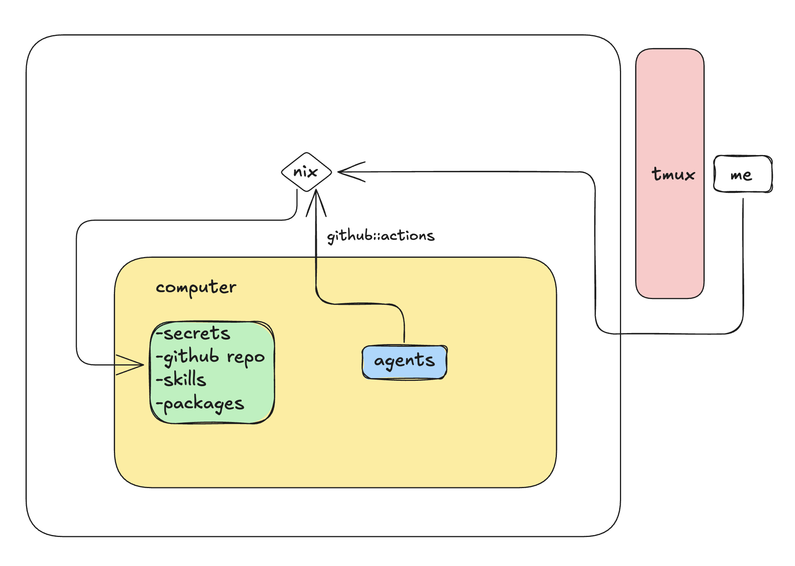

# Forking

Technical map of the repo so you know what to touch when you adapt it. Also: zero-to-box walkthrough and pointers for running home-manager on your Mac / KVM host.



## Zero to a working box

### 1. Install prereqs

```
curl -fsSL https://agentcomputer.ai/install.sh | bash
brew install just gum jq fzf gh     # or your package manager
brew install bitwarden-cli          # optional, only if you use bw for secrets
gh auth login
computer login
```

### 2. Fork the template

```
gh repo create my-computer-nix --template getcompanion-ai/computer-nix --public --clone
cd my-computer-nix
cp .env.example .env
```

Edit `.env`:

```
FLAKE_REF=github:<you>/my-computer-nix#computer
COMPUTER_SIZE=ram-4g
```

Commit and push — `FLAKE_REF` must resolve over the network:

```
git add . && git commit -m "init" && git push
```

### 3. Create a box, onboard, connect

```
just create mybox
just go mybox
computer ssh mybox --tmux
```

`just go` runs the full flow, idempotently per-box:

1. **switch** — installs Nix (Determinate installer) if missing, starts `nix-daemon`, runs `home-manager switch --flake $FLAKE_REF`. Cheap on re-run.
2. **auth** — pipes your laptop's `gh auth token` over stdin into `gh auth login --with-token` on the box, then `gh auth setup-git`. Skipped if already done.
3. **secrets** — if `./secrets.json` is missing, launches a `gum` fuzzy multi-select picker that discovers candidates from Bitwarden, env vars, and well-known config files. `secrets-apply.sh` then resolves every entry and pushes `~/.config/secrets/shell.zsh` (mode 0600) to the box. Skipped if already done.
4. **agent creds** — `computer claude-login` + `computer codex-login`. Skipped if already done.
5. **repos** — always launches the `gum` fuzzy picker over `gh repo list`. Previously-picked repos are pre-selected. Clones into the configured root.

Idempotency markers live at `~/.cache/computer-nix/*.done` on the box. Redo everything with `just go mybox force`.

### Iterating on the flake

Edit any `home/*.nix`, push to your fork, `just switch mybox`. The box fetches the new flake and reapplies.

For iteration without pushing:

```
computer sync ./ --computer mybox
computer ssh mybox -- 'nix run nixpkgs#home-manager -- switch \
  --flake path:/home/node/computer-nix#computer -b backup --no-write-lock-file'
```

## Repo tree

```
.
├── flake.nix            flake inputs + homeConfigurations.computer
├── home/                home-manager modules (programs.*, xdg, activation)
│   └── default.nix      imports every sibling module
├── skills.nix           declarative agent-skills manifest
├── justfile             user-facing commands; `just go` is the entrypoint
└── scripts/             bash implementing each justfile recipe
```

## What to change for a fork

| change | file |
| --- | --- |
| flake target | `.env` → `FLAKE_REF=github:<you>/my-computer-nix#computer` |
| default box size | `.env` → `COMPUTER_SIZE` |
| which tools are on the box | `home/packages.nix` |
| shell aliases | `home/aliases.nix` |
| prompt colors | `home/prompt.nix` (zstyle blocks at the top) |
| your neovim / dotfiles | `flake.nix` → `inputs.nvim-config.url` |
| agent skills installed | `skills.nix` at repo root |
| default clone root | `repos.example.json` → `"root"` |

## How the flake wires together

```
flake.nix
  ├── inputs.nixpkgs
  ├── inputs.home-manager
  └── inputs.nvim-config          (your dotfiles; flake = false)
        │
        ▼
  homeConfigurations.computer
        = home-manager.lib.homeManagerConfiguration {
            pkgs    = nixpkgs.legacyPackages.x86_64-linux;
            modules = [ ./home/default.nix ];
          }

home/default.nix
  imports every home/*.nix module. Adding a new module
  = create home/foo.nix + add `./foo.nix` to the imports list.
```

## How `just go` wires together

```
just go <handle>
  └── scripts/pick-handle.sh       ← pick once, use everywhere
        │
        ▼
  scripts/bootstrap.sh             ← nix install + home-manager switch
        │
        ▼  (skip if ~/.cache/computer-nix/auth.done)
  scripts/auth-apply.sh            ← gh auth on box
        │
        ▼  (skip if ~/.cache/computer-nix/secrets.done)
  scripts/secrets-init.sh          ← only if no ./secrets.json yet
  scripts/secrets-apply.sh         ← push secrets shell.zsh (0600)
        │
        ▼  (skip if ~/.cache/computer-nix/agent.done)
  computer claude-login / codex-login
        │
        ▼  (always)
  scripts/repos-init.sh            ← fuzzy picker (pre-selects last deploy)
  scripts/repos-apply.sh           ← clone or fast-forward each repo
```

Markers on the box live in `~/.cache/computer-nix/*.done`. Wipe them with `just go <handle> force` or `computer ssh <handle> -- rm -rf ~/.cache/computer-nix`.

## Sourcing your own nvim / zsh / dotfiles

```nix
# flake.nix
inputs.nvim-config = {
  url  = "github:<you>/<your-dotfiles>";
  flake = false;
};
```

`home/nvim.nix` reads `${inputs.nvim-config}/config/nvim` (adjust the path if your dotfiles layout differs). Run `nix flake update nvim-config` to repin.

## Adding a new home-manager module

1. Create `home/<tool>.nix` as a flat attrset — no header comment, match existing style.
2. Add `./<tool>.nix` to the imports list in `home/default.nix`.
3. `just switch <box>` to apply.

## Adding a new onboarding step

1. Write `scripts/<step>-apply.sh` taking `<handle>` as `$1`.
2. Add a recipe to the justfile that calls it via `pick-handle.sh`.
3. If it's expensive and one-shot, wire it into `just go` behind a marker check (`done_on_box <step>` / `mark_done <step>`). If it's per-task (like repos), call it unconditionally.

## Running home-manager on your Mac or KVM host

This repo is scoped to `x86_64-linux` boxes. If you want the same tools + dotfiles on your Mac or a local KVM VM, see [harivansh-afk/nix](https://github.com/harivansh-afk/nix) — it shares the same home-manager modules and nvim config across:

- **macOS (darwin)** via `nix-darwin` + `home-manager`
- **Linux (KVM / bare metal)** via NixOS + `home-manager`

The general pattern: point both repos at the same `nvim-config` flake input, and share `home/*.nix` modules by importing them from a common place (or vendoring them). Platform-specific bits (`programs.foo` that only exists on Linux) live behind `lib.mkIf pkgs.stdenv.isLinux`.
